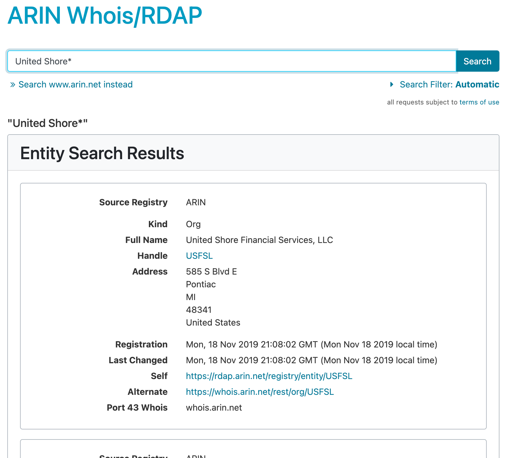
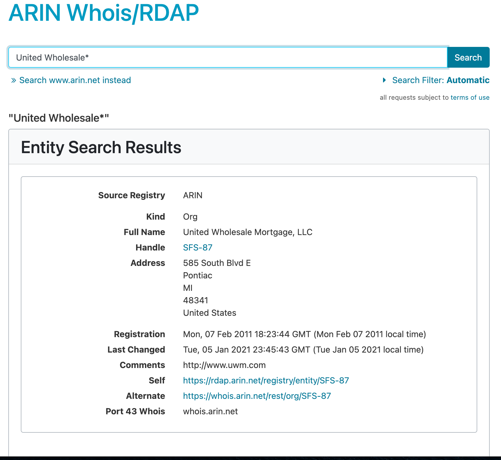

[American Registry for Internet Numbers (arin.net)](https://www.arin.net/)

The Regional Internet Registry (RIR) that serves most of North America.

Search by:

- Organization Name (use wildcards!)
- Domain name(s)
- IP address or IP address block
- ASN

[https://search.arin.net/rdap/](https://search.arin.net/rdap/)

