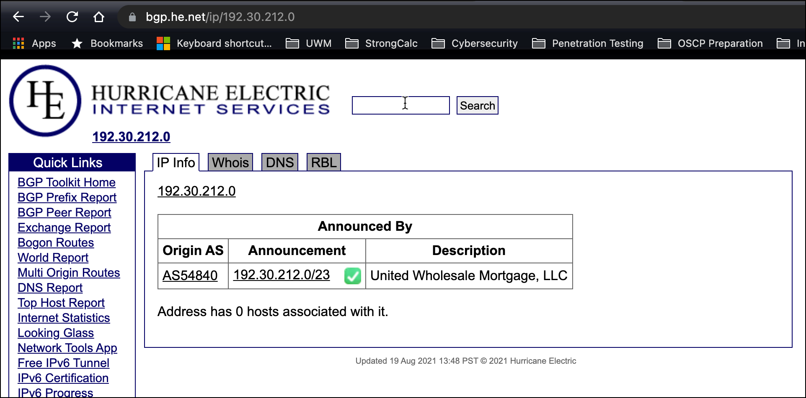
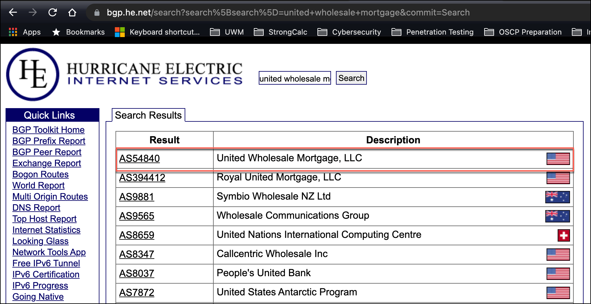
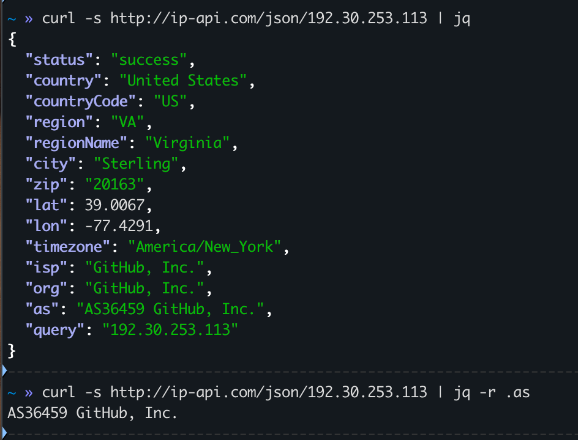
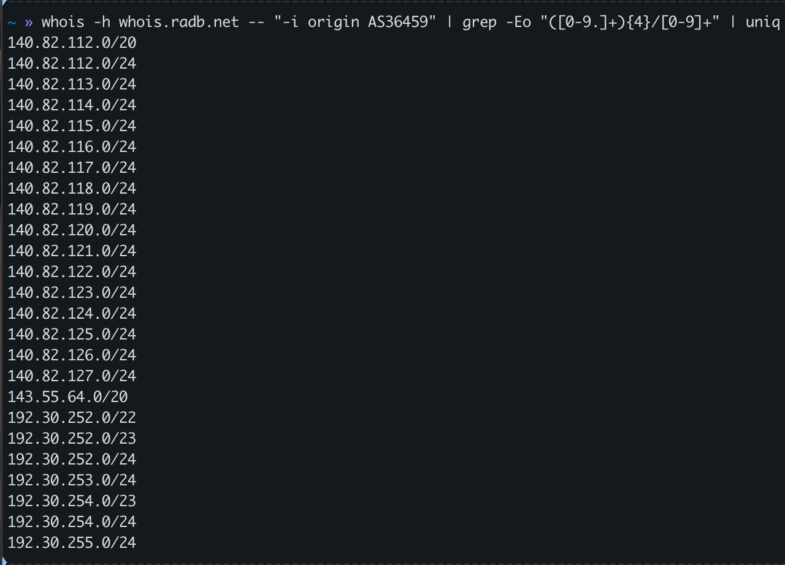
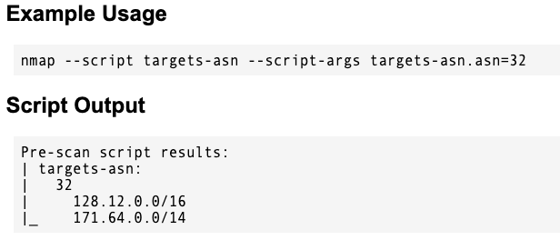

[Autonomous system (Internet) - Wikipedia](https://en.wikipedia.org/wiki/Autonomous_system_(Internet))

Autonomous Service Number == ASN

ASN discovery may assist with netblock identification of a target.

IP to ASN:

[https://asn.cymru.com/cgi-bin/whois.cgi](https://asn.cymru.com/cgi-bin/whois.cgi)
https://ip-api.com/


Domain Name to ASN:
Netblock to ASN:
IP to ASN:
Organization Name to ASN:

[http://bgp.he.net/](http://bgp.he.net/)
[https://ipinfo.io](https://ipinfo.io/AS31890#block-ranges)





``` bash
$ curl -s http://ip-api.com/json/<ip_address> | jq
$ curl -s http://ip-api.com/json/<ip_address> | jq -r .as
```



A WHOIS server may be queried for IP addresses related to an ASN, as well.

``` bash
$ whois -h <whois_server> -- "-i origin <ASN>" | grep -Eo "([0-9.]+){4}/[0-9]+" | uniq
```



There is a related nmap script as well: [targets-asn](https://nmap.org/nsedoc/scripts/targets-asn.html)




