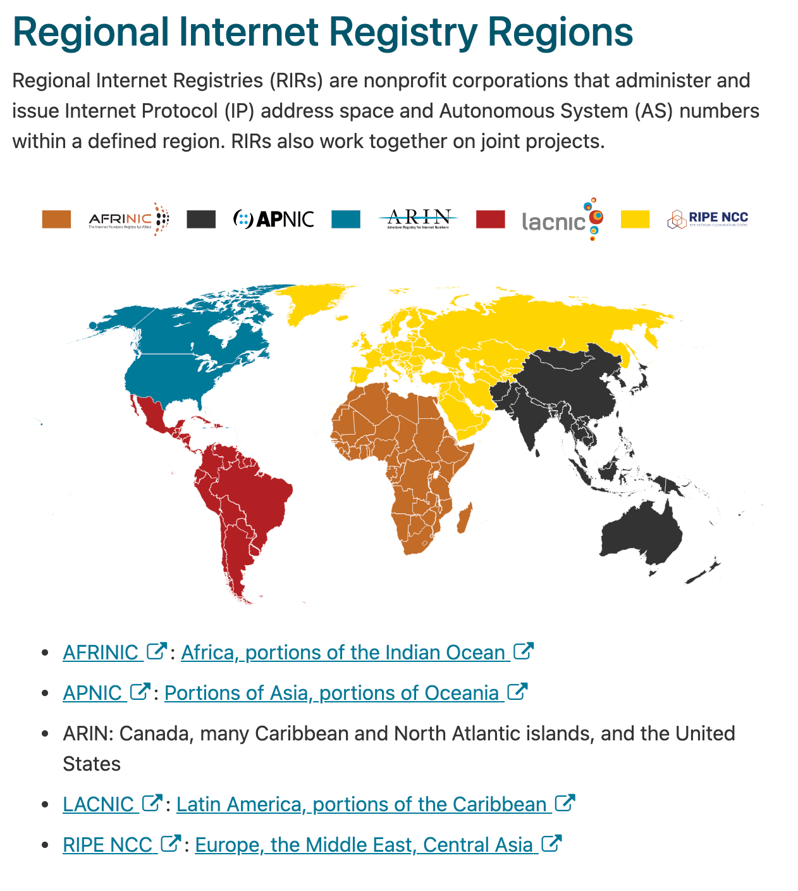

There are several Regional Internet Registries (RIRs) that store information in Whois databases.

[https://www.arin.net/about/welcome/region/#regional-internet-registry-regions](https://www.arin.net/about/welcome/region/#regional-internet-registry-regions)

| Registry                                                               | Notes |
| ---------------------------------------------------------------------- | ----- |
| [American Registry for Internet Numbers (ARIN)](https://www.arin.net/) |       |
| [https://www.afrinic.net/](https://www.afrinic.net/)                   |       |
| [https://www.apnic.net/](https://www.apnic.net/)                       |       |
| [https://www.lacnic.net/](https://www.lacnic.net/)                     |       |
| [https://www.ripe.net/](https://www.ripe.net/)                         |       |

These databases provide IP addresses and AS numbers (ASNs). AS stands for autonomous system and is represented by a number (ASN). 

An autonomous system is nothing more than a collection of IP addresses (a network) and associated routers under the control of a single administrator (such as a company). 

The autonomous system also presents a common routing policy with respect to the Internet (i.e. via BGP).

These databases also store DNS information.

*Note: not all organizations have IP address blocks assigned to them. Some obtain IP addresses from their ISP or lease them from some other provider (such as a cloud entity). It is important to consider the results carefully and confirm with the client before attacking a band of IP addresses.*