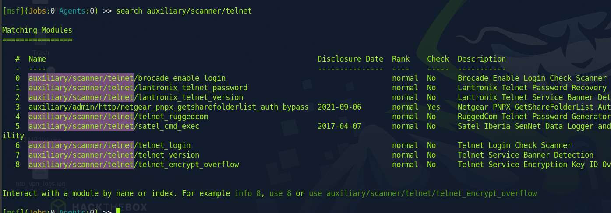
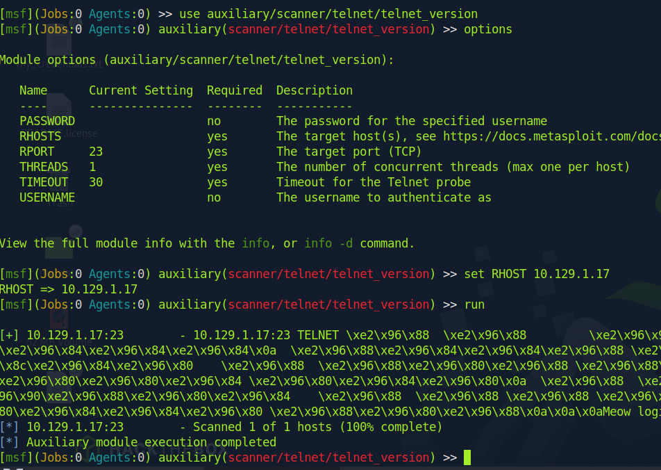

[Telnet Reference](../Reference/Networking/Protocols/TELNET.md)

https://book.hacktricks.xyz/network-services-pentesting/pentesting-telnet

### Discovery
Commonly discovered on a port scan:

`$ sudo nmap -n -p 23 -sTV <ip_address>`

Wireshark packet captures might also reveal telnet communication. Wireshark filter:

`tcp.port == 23`

### Enumeration
Commonly connected to with the telnet, netcat, ncat and other capable clients.

Banner grab with netcat:

`$ nc -nv <ip_address> 23`

Additional enumeration can be performed by nmap:

`$ sudo nmap -n -p -sTV --script "*telnet* and safe" <ip_address>`

Metasploit also has some modules for telnet enumeration:

Example:

`msf> use auxiliary/scanner/telnet/telnet_version`
`msf> set RHOST <ip_address>`
`msf> run`

### Exploitation
- Sniff plaintext credentials or data over network traffic
- Weak credentials / credential guessing
- Credential brute force