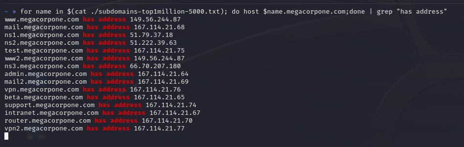

#dns 

Attempt to identify additional targets. 

#### Passive
1. https://crt.sh/
2. Google hacking => "poor man's DNS zone transfer"

#### Active
1. [zone_transfer](zone_transfer.md)
2. brute force (non-exhaustive list)
	1. [fierce](../../../../Tools/fierce/basic_usage.md)
	2. sublist3r
	3. [host](../../../../Tools/host/subdomain_brute_force.md)
	4. [DNSrecon](../../../../Tools/DNSrecon/basic_usage.md)
	5. [DNSenum](../../../../Tools/DNSenum/basic_usage.md)
	6. gobuster

Brute force could also be as simple as a list (like from SecLists) and a bash one-liner:

`$ for subdomain in $(cat <wordlist>); do host $subdomain.<domain>.<tld>; done`

Seclists has some good lists to get started with: https://github.com/danielmiessler/SecLists/tree/master/Discovery/DNS.

