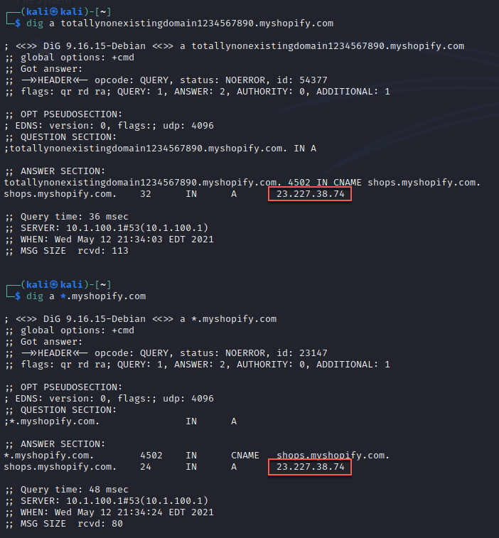

#dns 

https://0xpatrik.com/wildcard-domains/

Sometimes DNS is configured to point any subdomain to a particular host. This can throw off the results from an automated scanner and is something to watch out for.

Indicators:
* An unusually large number of valid domains
* A domain that obviously really shouldn't exist (i.e. areallystrangeandfakesubdomain.domain.com) returns a result instead of NXDOMAIN
* A wildcard query returns a valid result such as an CNAME record

