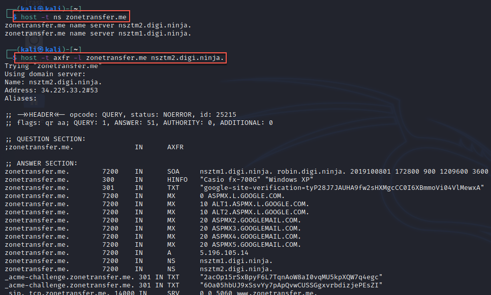

#dns 

Misconfiguration may allow anyone to "clone" or replicate a DNS zone. 

If discovered, this should be a finding:
1. Maintain external and internal DNS; keep internal entries on the internal server
2. Configure an allow list to allow only trusted IP addresses to replicate the zone

Example:

```
$ host -t ns <domain>
$ host -t axfr -l <domain> <nameserver>
```




Taking the `host` command for example, a simple bash script can help automate this given a domain:

```
#!/bin/bash

if [ -z "$1" ]; then

    echo "usage: $0 <domain name>"

    exit 1

fi

for server in $(host -t ns $1 | cut -d " " -f4); do

    host -t axfr -l $1 $server | grep "has address"

done
```

This script will attempt to identify all name server records for the domain and attempt a zone transfer from each one.


Tools:
[host](../../../../Tools/host/zone_transfer.md)
[dig](../../../../Tools/dig/zone_transfer.md)
[DNSenum](../../../../Tools/DNSenum/basic_usage.md)
[DNSrecon](../../../../Tools/DNSrecon/basic_usage.md)
