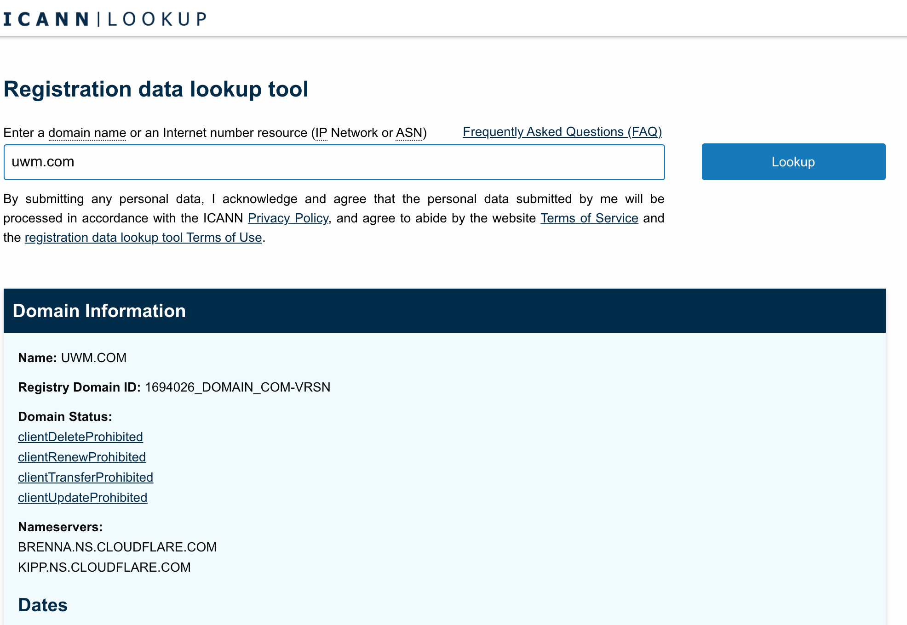
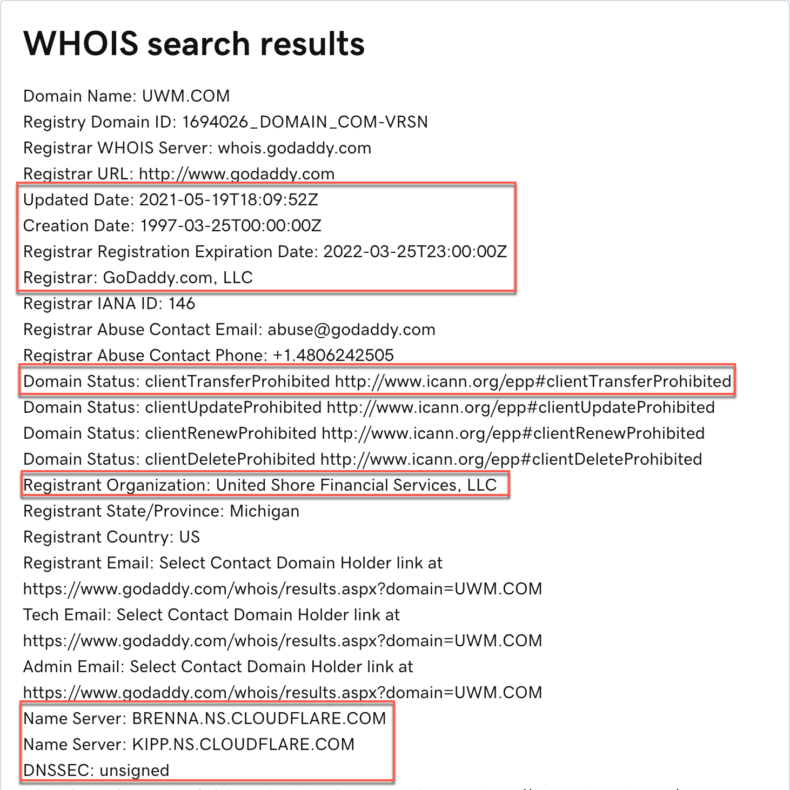

[Network Protocol](../../../../Reference/Networking/Protocols/WHOIS.md)

[Tool Reference](../../../../Tools/whois.md)

Whois is a query response protocol designed to provide information about Internet resources. More can be read here, if desired: [WHOIS](onenote:..\..\Reference\Networking\Network%20Services.one#WHOIS&section-id={8857C1D5-8E70-4DC6-BFC7-16906413F6BF}&page-id={86DA0B0F-97D9-424A-93CC-028045069CFC}&end&base-path=https://d.docs.live.net/8df27f53ca2bb86f/Documents/Penetration%20Testing%20Notes).

Many sites that offer whois information have a web-based front end. Linux includes a command-line tool for whois lookups. The sysinternals suite provides a version for Windows.

A good place to start is [https://www.internic.net/whois.html](https://www.internic.net/whois.html).

Identify the registrar (i.e. GoDaddy) and then explore the registrar for further details.

[https://www.godaddy.com/whois/results.aspx?checkAvail=1&domain=uwm.com](https://www.godaddy.com/whois/results.aspx?checkAvail=1&domain=uwm.com)

Some key things to note are:

- Domain creation, update and expiration dates
- Registrar
- If the DNS zone transfers are allowed (Domain Status: clientTransferProhibited means no)
- Registrant and contact information
- DNS name servers, listed in order of primary, secondary, tertiary, etc.
- DNSSEC status

*NOTE: the whois client can also perform a reverse lookup on an IP address, potentially yielding information from that direction.*

Another website that may be interesting is [https://domain.glass](https://domain.glass).