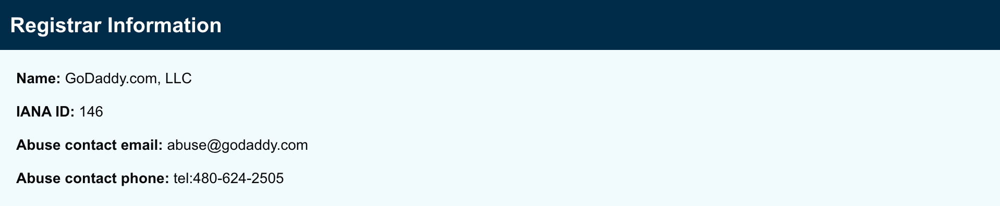

#whois 

WHOIS is a query response protocol designed to provide information about Internet resources. More can be read here: [WHOIS](../../../../Reference/Networking/Protocols/WHOIS.md). 

There is a related tool built into most operating systems designed to query WHOIS information: [whois](../../../../Tools/whois.md).

Many sites that offer whois information have a web-based front end. A good place to start is [https://www.internic.net/whois.html](https://www.internic.net/whois.html). Another website that may be interesting is [https://domain.glass](https://domain.glass).

Identify the registrar (i.e. GoDaddy) and then explore the registrar for further details.

[https://www.godaddy.com/whois/results.aspx?checkAvail=1&domain=uwm.com](https://www.godaddy.com/whois/results.aspx?checkAvail=1&domain=uwm.com)

Some key things to note are:

- Domain creation, update and expiration dates
- Registrar
- If the DNS zone transfers are allowed (Domain Status: clientTransferProhibited means no)
- Registrant and contact information
- DNS name servers, listed in order of primary, secondary, tertiary, etc.
- DNSSEC status

*NOTE: the whois client can also perform a reverse lookup on an IP address, potentially yielding information from that direction.*