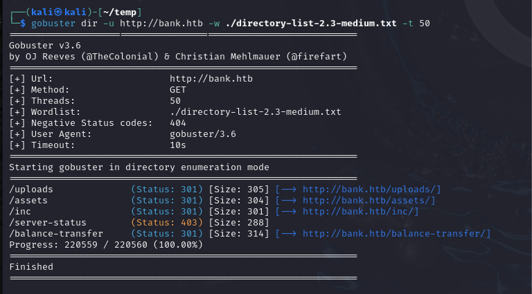

#web #directorybusting

Start this early and recursively, as necessary. Consider identifying the technology first to include potential file extensions.

The screenshot below is a demonstration using gobuster. Other tools are available and some have their advantages.

Example:

` $ gobuster dir -u <url> -w <wordlist> -t <thread_count> `

Tools:

dirbuster
dirb
gobuster
wfuzz
fuff