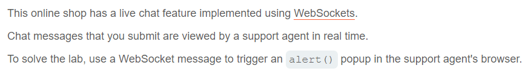
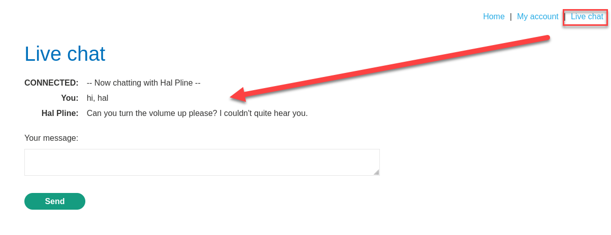
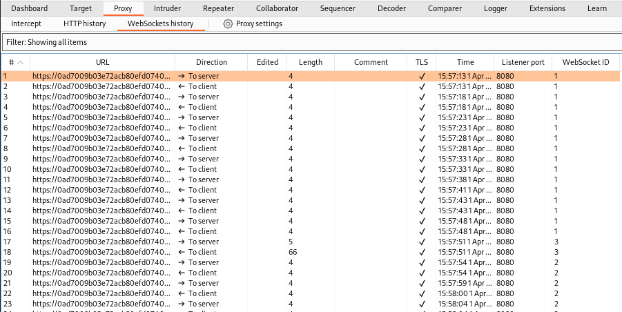
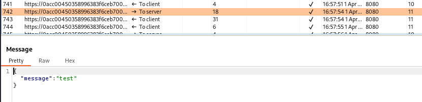
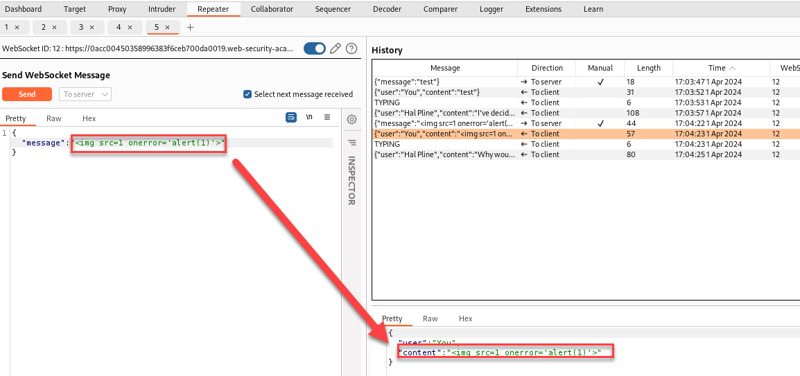
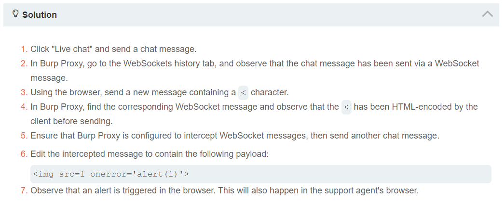

This example comes from PortSwigger Academy.

[Lab: Manipulating WebSocket messages to exploit vulnerabilities | Web Security Academy (portswigger.net)](https://portswigger.net/web-security/websockets/lab-manipulating-messages-to-exploit-vulnerabilities)

There's a live chat feature which appears to be fairly interactive. This is a common use case for web sockets due to the ability to poll, etc.

In fact, we can see the connection playing "ping pong":

We can see the user message being submitted.

If the other side of the chat is also being rendered in a browser, then it may be possible to submit an XSS attack if the input is not properly sanitized.

The objective is to cause an alert():

We can see that the payload is replayed back to the client, causing an alert().

Here is the official solution which took a slightly different route:

[Manipulating WebSocket messages to exploit vulnerabilities (Video solution) (youtube.com)](https://www.youtube.com/watch?v=63jRvCUkTEc)
