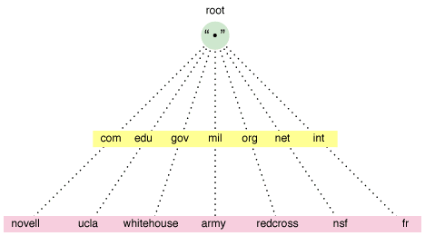

#dns

https://en.wikipedia.org/wiki/Domain_Name_System

Distributed, hierarchical database responsible for translating human-friendly names into machine-friendly IP addresses.

Often contains information that is useful for attackers.

The most common types of DNS records:

| NS    | Name server record                                                                                                  |
| ----- | ------------------------------------------------------------------------------------------------------------------- |
| A     | Address record for IPv4 addresses                                                                                   |
| AAA   | Address record for IPv6 addresses                                                                                   |
| HINFO | Host information record; associates an arbitrary set of information with a domain name                              |
| MX    | Mail exchange record; identifies mail servers for the domain                                                        |
| TXT   | Test record; includes an arbitrary text string for the domain                                                       |
| CNAME | Canonical name record; alias for a given host                                                                       |
| SOA   | Start of authority; indicates that a server is authoritative for that DNS zone (set of records)                     |
| RP    | Responsible person; informational, indicating human responsible for the domain (not used much)                      |
| PTR   | Pointer for inverse lookups; reverse records or IP to domain records                                                |
| SRV   | Service location records; provide information about available services, including port and hostname (not used much) |
| SPF   | sender policy framework; identifies which nameservers are permitted to send email on behalf of the domain           |

Tools:
	[basic_usage](../../../Tools/host/basic_usage.md)
	[whois](../../../Tools/whois.md) (nameserver)
	[basic_usage](../../../Tools/dig/basic_usage.md)
	[basic_usage](../../../Tools/nslookup/basic_usage.md)
	[basic_usage](../../../Tools/DNSenum/basic_usage.md)
	[basic_usage](../../../Tools/DNSrecon/basic_usage.md)
	[basic_usage](../../../Tools/fierce/basic_usage.md)