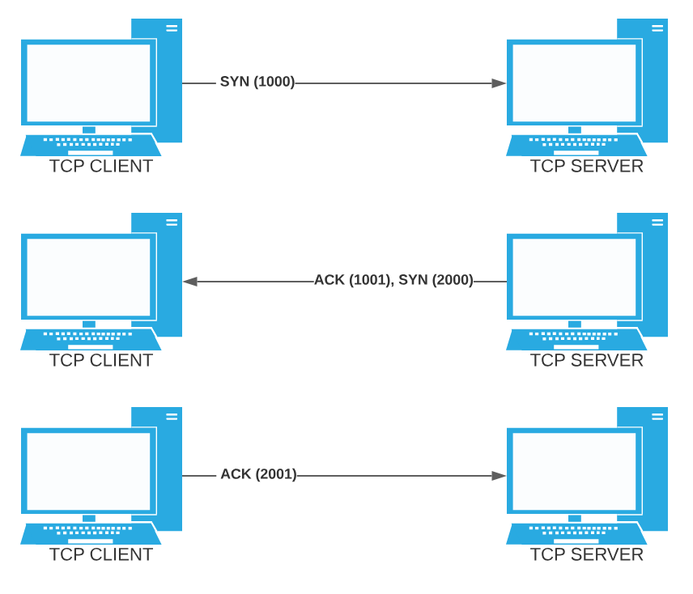

Transport-level protocol constructed to make sure messages get to the intended destination port on time and in the correct order.

[Transmission Control Protocol - Wikipedia](https://en.wikipedia.org/wiki/Transmission_Control_Protocol)

2-way communication with session.

Session is established via 3-way handshake (usually - there are other variations on the protocol).

1. Machine A sends Machine B a packet with the SYN flag set and a sequence number.
2. Machine B sends Machine A a packet with the SYN and ACK flags set, along with the original sequence number incremented by 1 and its own sequence number.
3. Machine A responds by sending a packet with the ACK flag set and Machine B's sequence number incremented by 1.

At this point the 

TCP introduces the concept of ports. Ports provide a means for a machine to have multiple inbound and outbound connections without the complexity of filtering, sorting, and routing within the machine itself. 

On a given machine, there are 65,536 ports (2^16), ranging from 0-65,535.

Ports 0-1023 are considered "well-known" ports used by frequently used network services.  