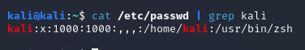

[passwd(5) - Linux manual page (man7.org)](https://man7.org/linux/man-pages/man5/passwd.5.html)

A colon separates fields as with /etc/shadow.

Does not require elevated permissions as it doesn't store passwords in modern day.

The fields:

| kali         | username in plaintext                                          |
| ------------ | -------------------------------------------------------------- |
| x            | indicates the password should be pulled from /etc/shadow       |
| 1000         | user ID (UID); 1000 is usually the first actual user           |
| 1000         | group ID (GID); 1000 is usually the first actual user group    |
| ,,,          | comment field; sometimes simply contains the username - varies |
| /home/kali   | home directory                                                 |
| /usr/bin/zsh | default shell                                                  |
