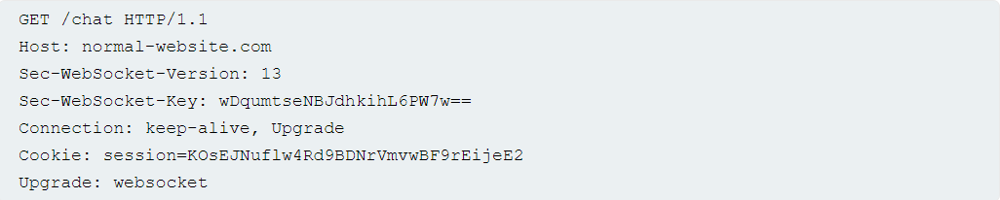
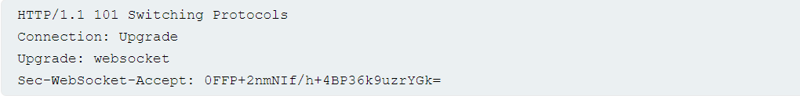

[WebSocket - Wikipedia](https://en.wikipedia.org/wiki/WebSocket)

[The WebSocket API (WebSockets) - Web APIs | MDN (mozilla.org)](https://developer.mozilla.org/en-US/docs/Web/API/WebSockets_API)

[RFC 6455: The WebSocket Protocol (rfc-editor.org)](https://www.rfc-editor.org/rfc/rfc6455)

[What are WebSockets? | Web Security Academy (portswigger.net)](https://portswigger.net/web-security/websockets/what-are-websockets)

"bi-directional, full duplex communications protocol initiated over HTTP"

* typically long-lived
* messages can be sent any time, in either direction unlike the request/response transactional nature of HTTP
* useful in server initiated message situations
* ws protocol is WebSockets over HTTP
* wss protocol is WebSockets over HTTPS

Web socket is established over HTTP via a handshake:

(client)

* Connection and Upgrade headers indicate a WebSocket handshake
* Sec-WebSocket-Version specifies protocol version - typically 13 (?)
* Sec-WebSocket-Key is a base64 encoded random value, regenerated with each handshake request

(server, if accepted)

* Sec-WebSocket-Accept value is a hashed value of Sec-WebSocket-Key from the initial handshake to help keep thing straight

The messages can be any data or format but are commonly JSON in modern web apps.