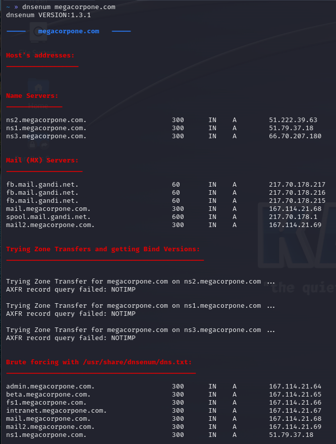

#dns #dnsenum

https://github.com/fwaeytens/dnsenum
https://www.kali.org/tools/dnsenum/

Performs several DNS enumeration tasks including attempting a zone transfer and subdomain bruteforce.

Example:

` $ dnsenum <domain> `

