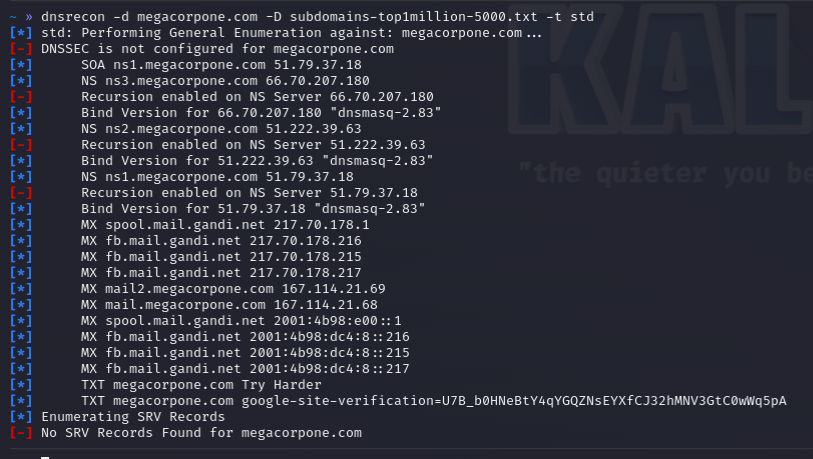

#dns #dnsrecon

https://github.com/darkoperator/dnsrecon
https://www.kali.org/tools/dnsrecon/

Performs a variety of DNS recon tasks including attempting zone transfers, etc.

Example:

` $ dnsrecon -d <domain> -D <wordlist> -t std `

