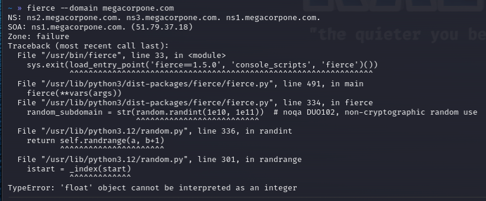

#dns #fierce

https://github.com/mschwager/fierce
https://www.kali.org/tools/fierce/

Examples:

```
$ fierce --domain <domain>
$ fierce --domain <domain> --subdomain-file <wordlist>
```

I included this for legacy purposes but at the time of creating this documentation fierce seems to have issues:

