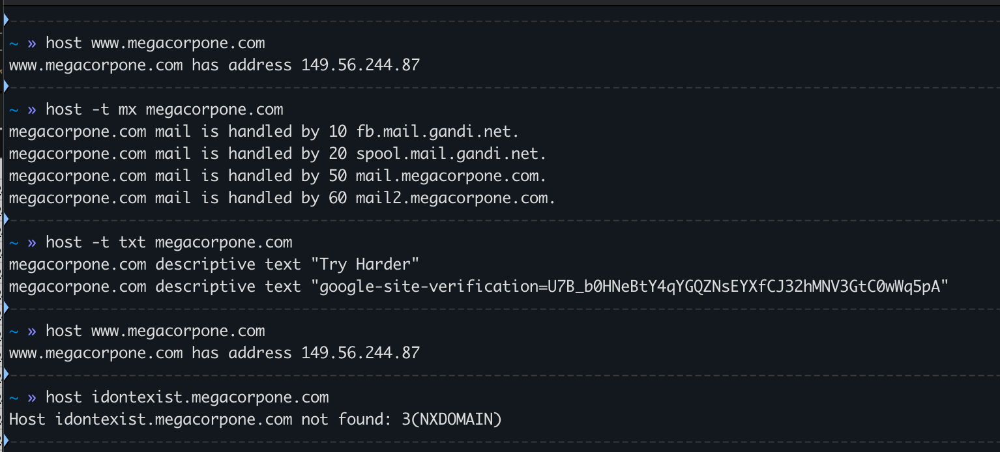

#dns #host

[DNS](../../Reference/Networking/Protocols/DNS.md) lookup utility.

https://www.geeksforgeeks.org/host-command-in-linux-with-examples/

https://linux.die.net/man/1/host

| Use Case                        | Command                                   | Notes                                                  |
| ------------------------------- | ----------------------------------------- | ------------------------------------------------------ |
| Lookup IP                       | `$ host <domain>`                         | can also be used with IP address                       |
| Lookup Specific Record Type     | `$ host -t mx <domain>`                   | example looks up mail records; can be used with others |
| Identify nameservers for domain | `$ host -t ns <domain>`                   |                                                        |
| Zone Transfer                   | `$ host -t axfr -l <domain> <nameserver>` |                                                        |
| Query Specific Nameserver       | ` $ host <domain> <nameserver> `          |                                                        |

