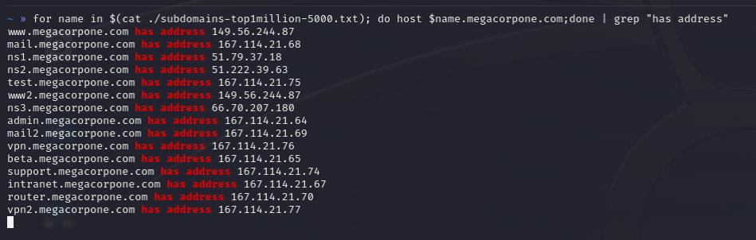

#dns #subdomain #host

The following one-liner may be used to automate the host command to brute force or reverse engineer a zone transfer:

` $ for ip in $(cat <list>); do host $ip.<domain>.com; done `

This can be used in creative means. Go bananas. Don't forget to use filtering for additional help.

