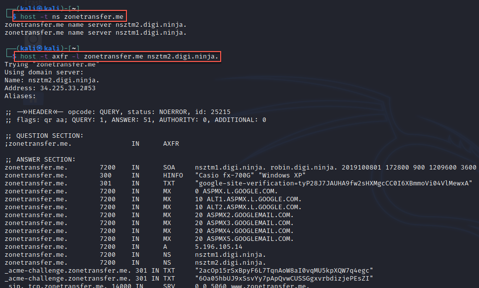

#dns #zonetransfer #host

`$ host -t ns <domain>`
`$ host -t axfr -l <domain> <nameserver>`




This can be automated:

```
#!/bin/bash

if [ -z "$1" ]; then

    echo "usage: $0 <domain name>"

    exit 1

fi

for server in $(host -t ns $1 | cut -d " " -f4); do

    host -l $1 $server | grep "has address"

done
```

Usage: 

` $ ./dns-zone-tran.sh  <domain>`