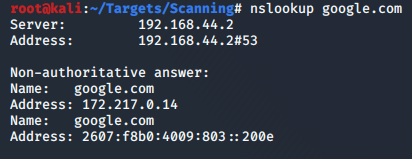
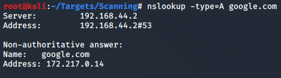
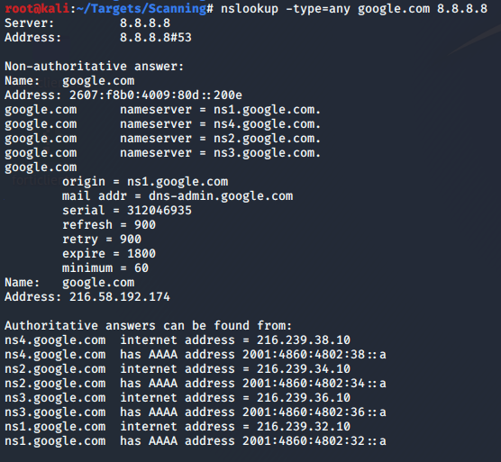

#nslookup 

Included in modern Windows, UNIX, and Linux systems.

https://en.wikipedia.org/wiki/Nslookup

Has 2 modes:
1. Interactive
2. CLI

Examples:

```
$ nslookup <domain>
$ nslookup -type=<record_type> <domain>
$ nslookup <domain> <name_server>
```






