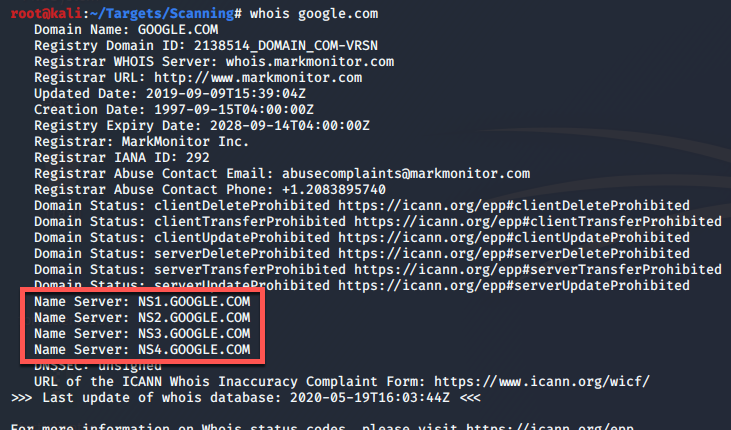
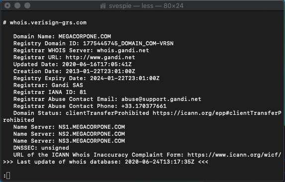

The whois tool can be used to obtain general information about a domain, particularly DNS servers. Whois is built into most Linux distros, but there is a version for Windows in the sysinternals suite.

[Whois - Sysinternals | Microsoft Learn](https://learn.microsoft.com/en-us/sysinternals/downloads/whois)

The whois tool uses the [WHOIS](../Technical-Reference/Networking/Protocols/WHOIS.md) network protocol.



Contact information may be found, as well.



Usage Suggestions:

``` bash
$ whois <domain_name>
$ whois -h <whois_server> <domain_name>
$ whois -h <whois_server> <domain_name> | grep Registrar
```


| Desired Output           | Grep Search Term          | Example                                           |
| ------------------------ | ------------------------- | ------------------------------------------------- |
| Registar                 | Registrar:                | $ cat whois.txt \| grep Registar:                 |
| Domain Transfer Allowed? | "Domain Status"           | $ cat whois.txt \| grep "Domain Status"           |
| Identify Name Servers    | "Name Server"             | $ cat whois.txt \| grep "Name Server"             |
| Is DNSSEC Enabled?       | "DNSSEC"                  | $ cat whois.txt \| grep "DNSSEC"                  |
| Owner Organization       | "Registrant Organization" | $ cat whois.txt \| grep "Registrant Organization" |
| Owner Country            | "Registrant Country"      | $ cat whois.txt \| grep "Registrant Country"      |
| Owner Phone              | "Registrant Phone"        | $ cat whois.txt \| grep "Registrant Phone"        |

[https://en.wikipedia.org/wiki/WHOIS](https://en.wikipedia.org/wiki/WHOIS)

[https://en.wikipedia.org/wiki/Name_server](https://en.wikipedia.org/wiki/Name_server)

[https://en.wikipedia.org/wiki/Domain_name_registrar](https://en.wikipedia.org/wiki/Domain_name_registrar)
