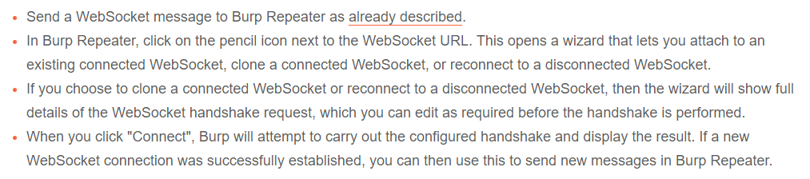

It may be possible to manipulate the WebSocket connection handshake. Some reasons for doing so:
* reach more attack surface
* establish a new connection because the existing one dopped
* stale data and/or tokens

Burp Suite repeater can be used to establish a new connection.

[Testing for WebSockets security vulnerabilities | Web Security Academy (portswigger.net)](https://portswigger.net/web-security/websockets#manipulating-websocket-connections)
