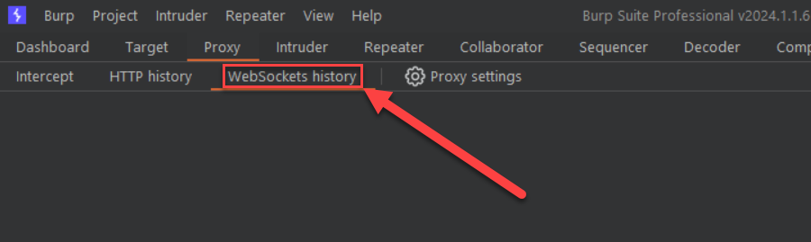
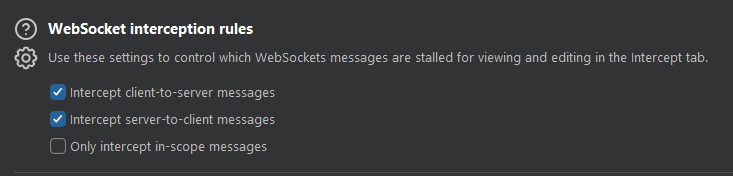
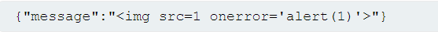

Tools like Burp Suite can capture and intercept WebSocket traffic. The proxy tool includes a WebSockets tab.

The WebSocket proxy settings:

Once intercepted, it is possible to manipulate and replay WebSocket traffic in the same way as HTTP traffic (depending on the data format in the intercepted messages).

Messages can be manipulated to conceivably execute traditional web application attacks such as XSS, SQL injection, command injection, etc.

XSS example:

[Working with WebSocket messages in Burp Repeater - PortSwigger](https://portswigger.net/burp/documentation/desktop/tools/repeater/websocket-messages)
